# **Advanced Lane Finding Project**

##1. Camera Calibration

###1.1 Computation of the camera calibration matrix and distortion coefficients 
The code for this step is contained in "output_images/project_camera_caliblation.py".  
It corrects 3D "object points" and 2D "image points" and calculates matrices for camera calibration.

"object points" is a list of 3D position, like (x, y, z), at which the checker board corners should exist in the world position.  
The checkerboard can be assumed that it is on the z==0 surface, therefore we can simply define "object points" for each checkerboard image as following code.

```
# line 8,9
objp = np.zeros((6*9, 3), np.float32)
objp[:, :2] = np.mgrid[0:9, 0:6].T.reshape(-1, 2)
```

"image points" are the 2D corner positions of the checker board images.
The corner positions are detected automaticaly from images in "camera_cal" folder provided by Udacity using opencv function, cv2.findChessboardCorners as following code.

```
# line 11-12
# termination criteria
criteria = (cv2.TERM_CRITERIA_EPS + cv2.TERM_CRITERIA_MAX_ITER, 30, 0.001)


# line 24-27
gray = cv2.cvtColor(img, cv2.COLOR_BGR2GRAY)

# Find the chessboard corners
ret, corners = cv2.findChessboardCorners(gray, (9, 6), None)
```
 
Here, "criteria" is used to calculate the corner positions with high precision.  
After "cv2.findChessboardCorners" exit normally, 
the corner positions are calculated again via "cv2.cornerSubPix" function with subpixel precision.
Then the image corner positions and the object world points are appended into lists, objpoints and imgpoints as following code.

```
# line 29-35
# If found, add object points, image points
if ret:
    # calculate subpixel positions
    cv2.cornerSubPix(gray, corners, (11,11), (-1,-1), criteria)
    
    objpoints.append(objp)
    imgpoints.append(corners)
```

This process is repeated for 20 images in the "camera_cal" folder.  
Then the objpoints and imgpoints are used to compute the camera calibration and distortion coefficients using the cv2.calibrateCamera() function.
Once the coefficients are given, we can do distortion correction to images using the "cv2.undistort()" function and obtaine this result as following code.

```
# line 37-45
# Test undistortion on an image
img = cv2.imread('../camera_cal/calibration1.jpg')
img_size = (img.shape[1], img.shape[0])

# Do camera calibration given object points and image points
ret, mtx, dist, rvecs, tvecs = cv2.calibrateCamera(objpoints, imgpoints, img_size, None, None)

dst = cv2.undistort(img, mtx, dist, None, mtx)
cv2.imwrite('test_undist.jpg', dst)
```

Following figure is the result.  
This undistortion process mostly works well, but the undistorted image still has some distortion on the left side of the image.

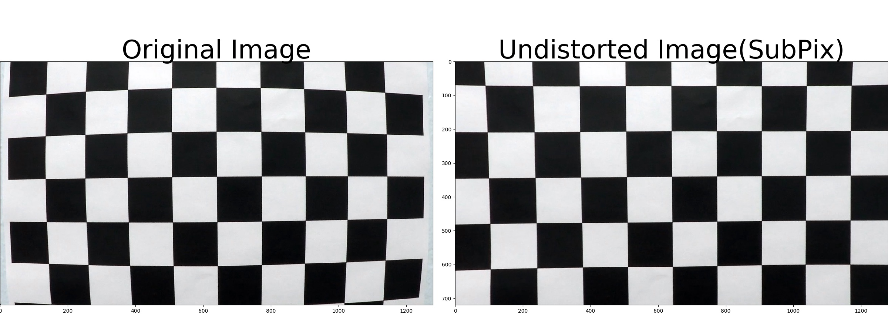


Following figure is a result computed with pixel precision (not subpixel).  
There is not specific difference between pixel and subpixel precision for this project.

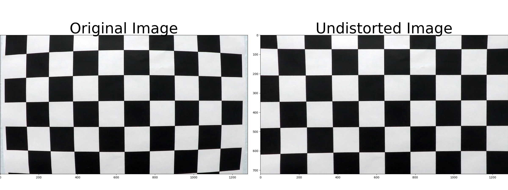


##2. Pipeline (single images)

The code for this step is contained in "output_images/project_pipeline.py".

###2.1. Distortion Correction
This code reads the saved camera matrix and distortion coefficients at line 7-11 at once when the code is executed.

```
# Read in the saved camera matrix and distortion coefficients
# These are the arrays you calculated using cv2.calibrateCamera()
dist_pickle = pickle.load(open("wide_dist_pickle.p", "rb"))
mtx = dist_pickle["mtx"]
dist = dist_pickle["dist"]
```

Each input image frames is undistorted using the matrix and distortion coefficients at the first of process_image(image) function at line 348.

    # 1) Undistort using mtx and dist
    undist = cv2.undistort(image, mtx, dist, None, mtx)

Following images are a sample input image and its undistorted image.  
It shows bented objects, like lanes and flyover roads, on the input image are corrected via the undistortion process described above.

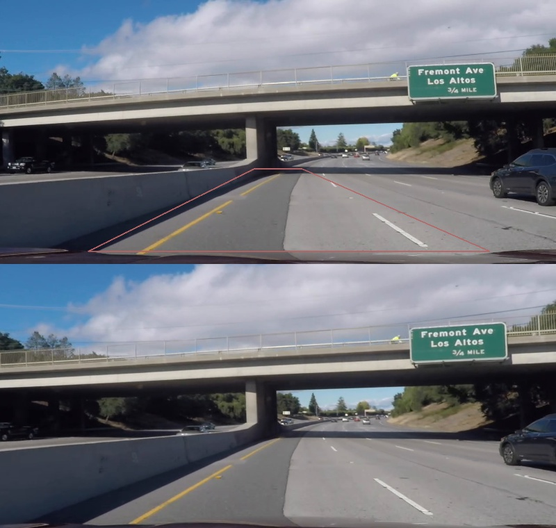


###2.2. Binary Image Conversion
This code creates binary images for each frames of the input video at line 351, 
and the binary images are used to the latter finding-lanes process.

    # 2) Create binary image via Combining Threshold
    combined = create_binary_image_light(undist)

Generally, such binary images can have a lot of pseudo information to cause troubles on line-finding algorithms,
so I tried to restrict each target objects to detect.

####2.2.1 Edge on the Road

First, I got binary images via edge based method lectured on the lesson as following code and a sample result image.

    # Line Edge
    gray = cv2.cvtColor(image, cv2.COLOR_RGB2GRAY)
    ksize = 3  # Choose a larger odd number to smooth gradient measurements
    gradx = abs_sobel_thresh(gray, orient='x', sobel_kernel=ksize, sobel_thresh=(25, 50))
    grady = abs_sobel_thresh(gray, orient='y', sobel_kernel=ksize, sobel_thresh=(50, 150))
    mag_binary = mag_thresh(gray, sobel_kernel=15, mag_thresh=(50, 250))
    dir_binary = dir_threshold(gray, sobel_kernel=7, thresh=(0.7, 1.3))
    hls_binary = hls_select(image, hthresh=(0, 255), ithresh=(0, 255), sthresh=(90, 190))  # Asphalt color

    combined = np.zeros((mag_binary.shape), dtype=np.uint8)
    combined[((gradx == 1) | (grady == 1) | ((mag_binary == 1) & (dir_binary == 1)) | (hls_binary == 1)) & (hls_binary2 != 1)] = 1

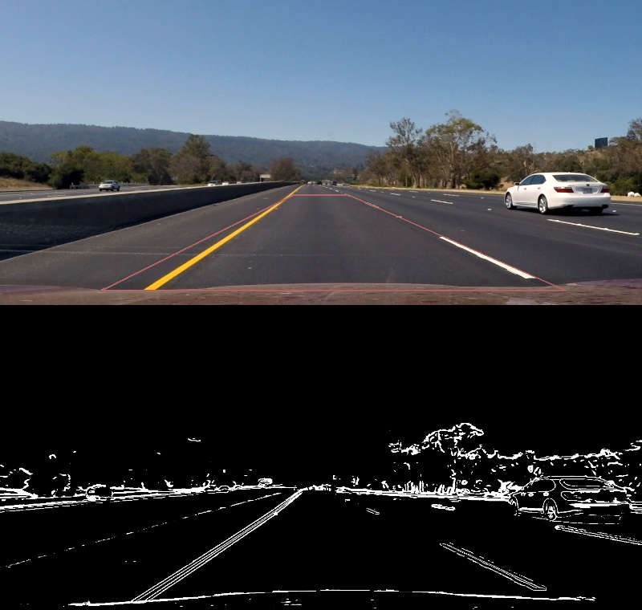

It works very well but has some issues as follows.

- weak at yellow lines
- strong shades and shadows cause failure at lane-detecton

Next, I made some other filters.

####2.2.2 Two types of Yellow line
I checked three videos, and found there are roughly two types of Yellow-line.
Because they have a little bit different Hue and Luminance, so I have two set of thresholds for them.

    # Yellow Line
    hls_yellow1 = hls_select(image, hthresh=(10, 30), ithresh=(50, 150), sthresh=(30, 255))  # yellow line dark
    hls_yellow2 = hls_select(image, hthresh=(20, 30), ithresh=(120, 250), sthresh=(30, 255))  # yellow line light
    
    combined[((hls_yellow1 == 1) | (hls_yellow2 == 1))] = 1  # yellow lines

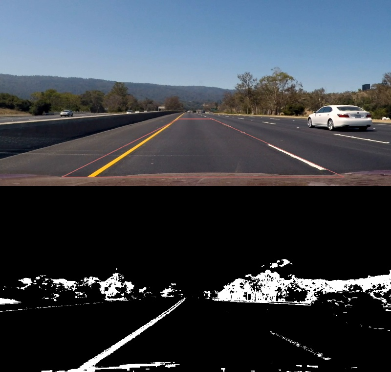
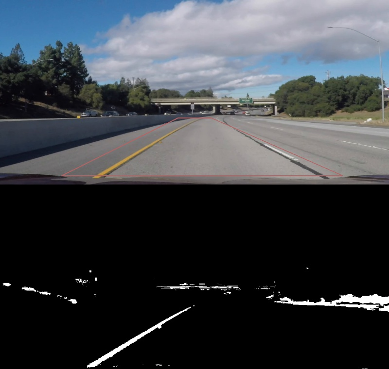

####2.2.3 White line
Egde-base method detects white lines but as hollow shapes.
Because Sliding-windows method for lane detection estimates lines with the number of pixles in each window, solid shapes would be matched to the method.

The code to detect white lines as splid shape and the result image are as follows.

    # White Line
    rgb_white = rgb_select(image, rthresh=(200, 255), gthresh=(200, 255), bthresh=(200, 255))  # white line
    rgb_excess = rgb_select(image, rthresh=(250, 255), gthresh=(250, 255), bthresh=(250, 255))  # white line
    
    combined[((rgb_white == 1) & (rgb_excess != 1))] = 1  # White line

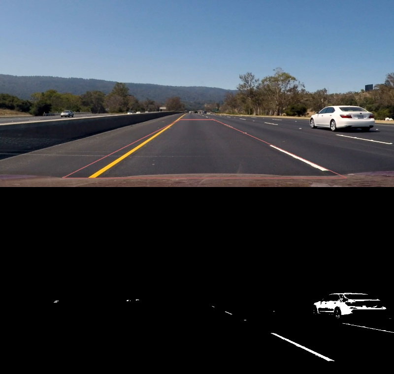


####2.2.4 Combined binary image
I had a easy comparison between two types of the combination way as follows.

One is edge-detection based algorithm.
This would be adaptable to any camera exposure conditions.

    # edge-detection based algorithm.
    combined = np.zeros((mag_binary.shape), dtype=np.uint8)
    combined[((gradx == 1) | (grady == 1) | ((mag_binary == 1) & (dir_binary == 1)) | (hls_binary == 1)) & (hls_binary2 != 1)] = 1

Another is a simple and light algorithm.
This would be weak at variable camera exposure conditions, but is estimatable in a shorter time than edge-detection based method.

    # light algorithm
    combined = np.zeros((rgb_white.shape), dtype=np.uint8)
    combined[((hls_yellow1 == 1) | (hls_yellow2 == 1))] = 1  # yellow line
    combined[((rgb_white == 1) & (rgb_excess != 1))] = 1  # White line

Ragarding to the target videos, "project_video.mp4" and "challenge_video.mp4", 
there is not specific difference in performance with the sliding windows search.

So I take the latter light algorithm for the report to create output videos.

This step in the code is shown in the function "create_binary_image(image)" or "create_binary_image_light(image)".
And the sample of the result is as follows.

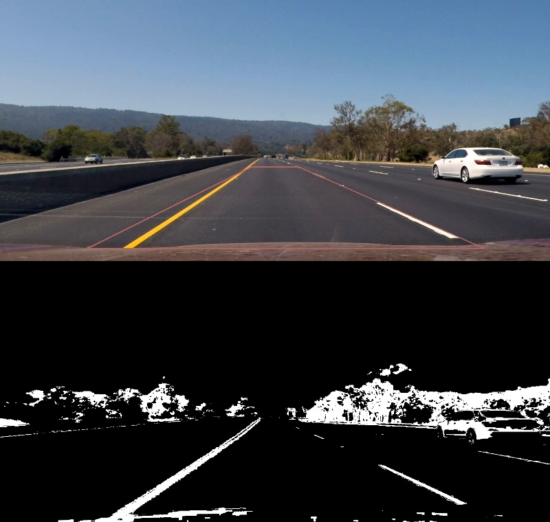


###2.3. Perspective Transformation

This code creates executes perspective transformations at line 354.

    # 3) Perspective Transform
    binary_warped = warper(combined, M)

"warper()" functon takes as inputs an binary image and an Matrix "M".

"M" is supposed to be calculated in advance via cv2.getPerspectiveTransform() with following parameters.  
These parameters are based on the values at "writeup_template.md" in the project, except avoiding the vehivle's bonnet.

| Source        | Destination   | 
|:-------------:|:-------------:| 
| 585, 460      | 320, 0        | 
| 203, 685      | 320, 720      |
| 1127, 685     | 960, 720      |
| 695, 460      | 960, 0        |

<!--  -->
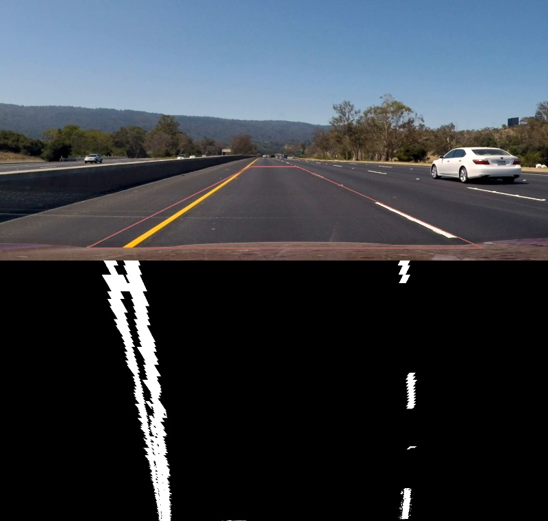

Before I took the Udacity provided values, I had some trial to use farther road than the sample code, but could not get good result. 
The video resolution don't seem to match at long distance roads and caused troubles at latter processes.  
The failure parameters and the transformed image is as follows ().

| Source        | Destination   | 
|:-------------:|:-------------:| 
| 600, 440      | 320, 0        | 
| 640, 440      | 320, 720      |
| 1105, 675     | 960, 720      |
| 295, 675      | 960, 0        |

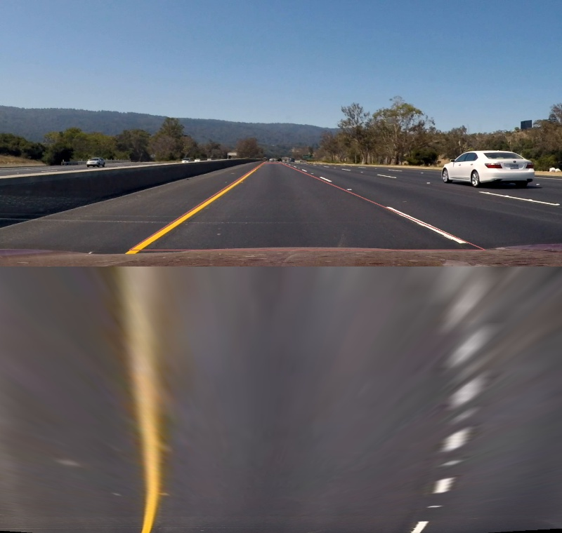

In addition to the result of the experiment, I don't have any information about distance in the videos except the sample parameters means actually 30m in the real world.


###2.4. Lane-Line pixels and fitting positions with a polynomial

This code search two lines at both side of the lane at line 356-370

    # 4) Find Lanes via Sliding Windows: 1st Method

    # 4-1) search lane candidates
    c_left_fit, c_right_fit, out_img = sliding_windows_search(binary_warped)

    # 4-2) Generate x and y values for pixel image
    left_fitx, right_fitx, ploty = fit_quadratic_polynomial(c_left_fit, c_right_fit, binary_warped)

    # 4-3) Check initial status of SlidingWindow function
    left_validity = True
    right_validity = True
    if c_left_fit[1] == 0:
        left_validity = False
    if c_right_fit[1] == 0:
        right_validity = False

"sliding_windows_search()" functon executes my perspective transform, which function takes as inputs an binary image "image".

This function is based on the first sample of "siliding windows search" in the lesson, and modified to have inertia when there is not enough number of good_index in a window.
To prevent excessive inertia, sliding windows have overlapping.

The function extracts two index lists for left and right lane-line.
And the detected index points are approximated into a quadratic polynomial via numpy function "np.polyfit()".  
So two sets of the quadratic polynomial coefficients are outputed from the function with a image which shows the execursions of the sliding-windows.

<!--  -->

Following figure shows the two polynomials and the execursions.

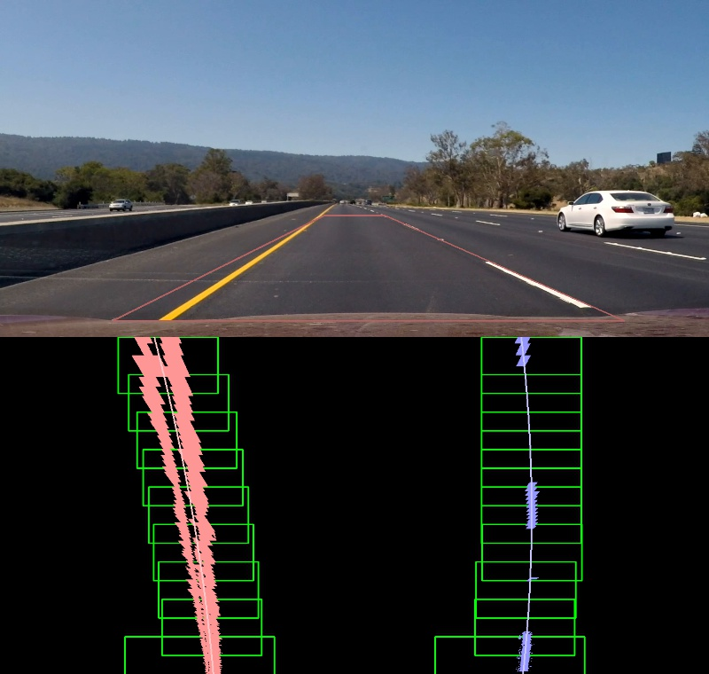

<!--
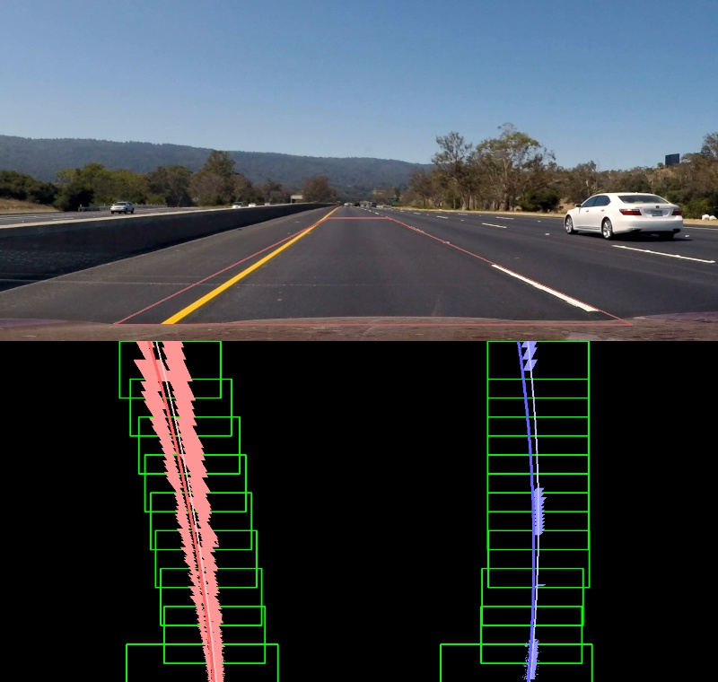
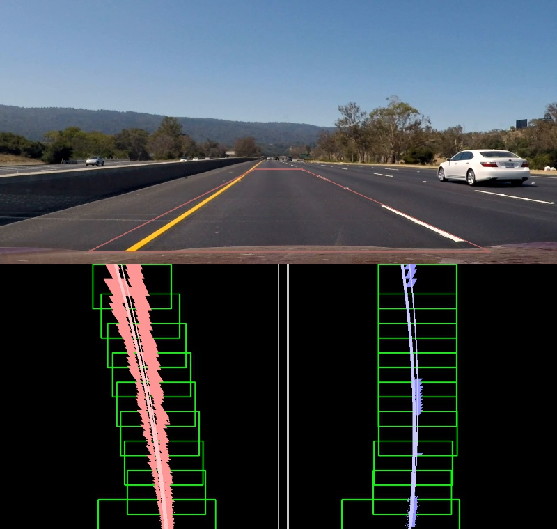
-->

###2.5. The radius of curvature of the lane and the position of the vehicle

This code determines the curvature of the lane at line 372-380.

    # 5) Determine the lane curvature
    global left_fit, right_fit
    global pre_left_fit, pre_right_fit
    global left_curverad, right_curverad
    global pre_left_curverad, pre_right_curverad

    ym_per_pix = 30 / 720  # meters per pixel in y dimension
    xm_per_pix = 3.7 / 700  # meters per pixel in x dimension

    c_left_curverad = measure_curvature(left_fitx, ploty, ym_per_pix=ym_per_pix, xm_per_pix=xm_per_pix)
    c_right_curverad = measure_curvature(right_fitx, ploty, ym_per_pix=ym_per_pix, xm_per_pix=xm_per_pix)

    if left_curverad == 0:
        left_curverad = c_left_curverad
    if right_curverad == 0:
        right_curverad = c_right_curverad

"measure_curvature(xs, ys, ym_per_pix, xm_per_pix)" is a lapper function of the formula that calculates the radius of the curvature in meter.

```
def measure_curvature(xs, ys, ym_per_pix, xm_per_pix):
    # Fit new polynomials to x,y in world space
    fit_cr = np.polyfit(ys * ym_per_pix, xs * xm_per_pix, 2)
    # Calculate the new radii of curvature
    y_eval = np.max(ys)
    curverad = ((1 + (2 * fit_cr[0] * y_eval * ym_per_pix + fit_cr[1]) ** 2) ** 1.5) / np.absolute(2 * fit_cr[0])
    # Now our radius of curvature is in meters
    return curverad
```

Here the calculated two curvature values are still candidates.
The two curvature values would be used for the calculation the curvature of the lane after they pass some sanity checks at line 389-412.

The sanity checks are consist of three functions as following code.
"sanity_chack_polynomial()" removes fitted coefficient sets if their values are uncommon.
"sanity_chack_curverad()" removes curvature values if they have a large variance from previous frame.
"sanity_chack_roadwidth()" remove both fitted lines if they are not parallel.

    # 6) Sanity Check

    # 6-1) Checking that they have stable coefficients
    c_left_validity, pre_left_fit = sanity_chack_polynomial(c_left_fit, pre_left_fit, thresh0=(-0.0007, 0.0007), thresh1=(-0.5, 0.5), thresh2=(-200, 200))
    c_right_validity, pre_right_fit = sanity_chack_polynomial(c_right_fit, pre_right_fit, thresh0=(-0.0007, 0.0007), thresh1=(-0.5, 0.5), thresh2=(-200, 200))
    if not c_left_validity:
        left_validity = False
    if not c_right_validity:
        right_validity = False

    # 6-2) Checking that they have similar curvature
    c_left_validity, c_right_validity = sanity_chack_curverad(c_left_curverad, c_right_curverad, diff_curverad_thresh=30)
    if not c_left_validity:
        left_validity = False
    if not c_right_validity:
        right_validity = False

    # 6-3) Checking that they are separated by approximately the right distance horizontally
    # 6-4) Checking that they are roughly parallel
    c_validity = sanity_chack_roadwidth(left_fitx, right_fitx, thresh0=(200, 1180), thresh1=(400, 1050), thresh2=(500, 780))  # 640 at horizontal road
    if left_validity and right_validity and not c_validity:
        right_validity = False
        left_validity = False


After the sanity check,
coefficients of the fitted lane lines and curvature values are stored as current frame's values,
and then the car position in the lane is calculated, at line 413-435.

    # 7) Update Status

    # 7-1) Update Fitting Data
    if c_left_fit[2] != 0 and left_validity:
        left_fit = (left_fit + c_left_fit) / 2
    if c_right_fit[2] != 0 and right_validity:
        right_fit = (right_fit + c_right_fit) / 2
    # if left_validity:
    #     left_fit = c_left_fit
    # if right_validity:
    #     right_fit = c_right_fit

    # 7-2) Determine Curvature Value
    if left_curverad == 0 or left_validity:
        left_curverad = c_left_curverad
    if right_curverad == 0 or right_validity:
        right_curverad = c_right_curverad

    # 7-3) Detect car position in the lane
    left_fitx, right_fitx, ploty = fit_quadratic_polynomial(left_fit, right_fit, binary_warped)
    lane_center = (left_fitx[-1] + right_fitx[-1]) / 2
    vehicle_offset = 1280 / 2 - lane_center
    vehicle_offset *= xm_per_pix

###2.6. An example image plotted back down onto the road the lane area

This code output an overlaied image for each frames at line 441-475.

    # 8)Drawing

    # Create an image to draw the lines on
    warp_zero = np.zeros_like(binary_warped).astype(np.uint8)
    color_warp = np.dstack((warp_zero, warp_zero, warp_zero))

    # Recast the x and y points into usable format for cv2.fillPoly()
    pts_left = np.array([np.transpose(np.vstack([left_fitx, ploty]))])
    pts_right = np.array([np.flipud(np.transpose(np.vstack([right_fitx, ploty])))])
    pts = np.hstack((pts_left, pts_right))

    # Draw the lane onto the warped blank image
    cv2.fillPoly(color_warp, np.int_([pts]), (0, 255, 0))

    center_fitx = (right_fitx + left_fitx) / 2
    for x, y in zip(center_fitx, ploty):
        cv2.circle(color_warp, (int(x), int(y)), 1, color=[255, 255, 255], thickness=8)

    # Warp the blank back to original image space using inverse perspective matrix (Minv)
    # newwarp = cv2.warpPerspective(color_warp, Minv, (image.shape[1], image.shape[0]))
    newwarp = warper(color_warp, Minv)

    # Combine the result with the original image
    font_size = 1.2
    font = cv2.FONT_HERSHEY_DUPLEX
    # infotext = 'offset {:+4.1f}m, curvature left:{:.1f}m,  right:{:.1f}m'.format(vehicle_offset, left_curverad, right_curverad)
    if vehicle_offset < 0:
        infotext = 'car position {:4.2f}m left , curvature {:7.1f}m'.format(-vehicle_offset, (left_curverad + right_curverad) / 2)
    elif vehicle_offset > 0:
        infotext = 'car position {:4.2f}m right, curvature {:7.1f}m'.format(vehicle_offset, (left_curverad + right_curverad) / 2)
    else:
        infotext = 'car position        center, curvature {:7.1f}m'.format((left_curverad + right_curverad)/2)
    cv2.putText(undist, infotext, (30, 50), font, font_size, (255, 255, 255))

    return cv2.addWeighted(undist, 1, newwarp, 0.3, 0)

Following figure is an example image which is overlaid with road area by green color, the current car position and the curvature of the lane.

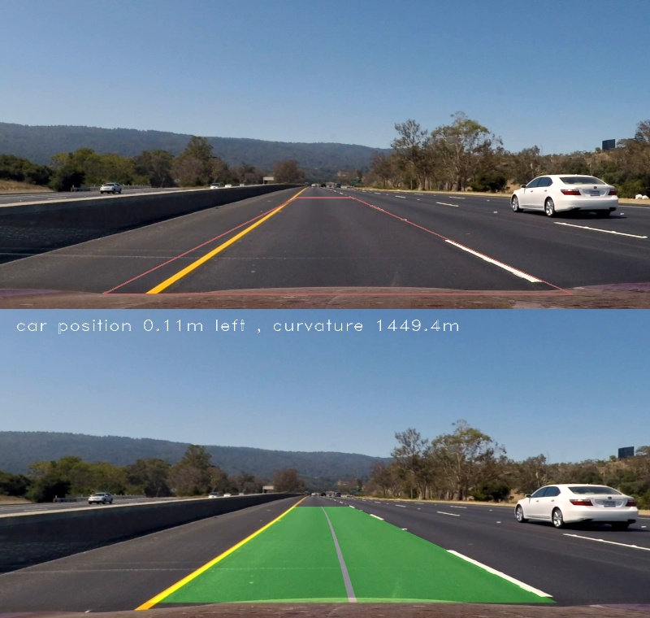

---

##3. Pipeline (video)

The code for this step is contained in "output_images/project_pipeline_video.py".  
The content of processing is similar to the pipeline for single images, except of its output is to mp4 video files not on the display.

Here is [a result for project_video.mp4](./output_images/project_video_out.mp4).

And here is [a result for challenge_video.mp4](./output_images/challenge_video_out.mp4).


---

##4. Conclusion

###4.1 Discussion; How to create binary images with stable quality
Just among three videos, it was really diffucult for me to tune the pipeline to work well with same parameters.
Creating binary images has the most important issue, I guess, because all latter process are affected seriously.

###4.2 Discussion; How to handle consecutive failure frames.
When the detection process fails for consecutive multiple frames, should I somehow create groundless something or keep former examined value (but no longer available) ?

On this project, I tried to restrict the pixel number of the lane lines and interpolate the deficit via rule-base way.
But I can not reach good mwthod.

All techniques I tried on the project may not have practical performance for the autonomous car.


EOF
