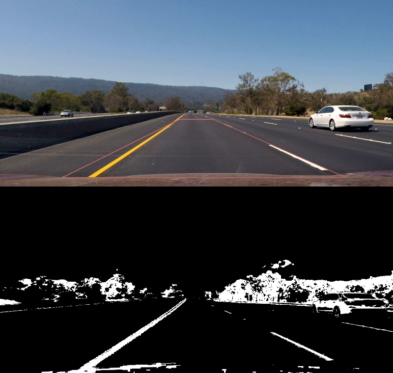
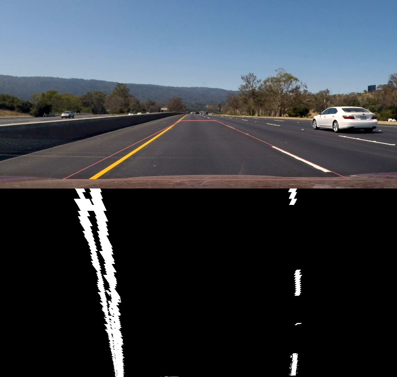
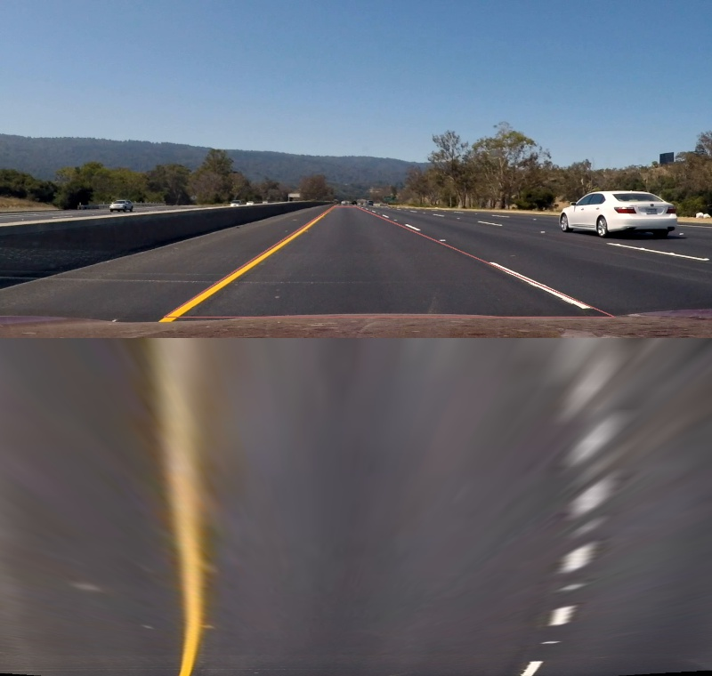
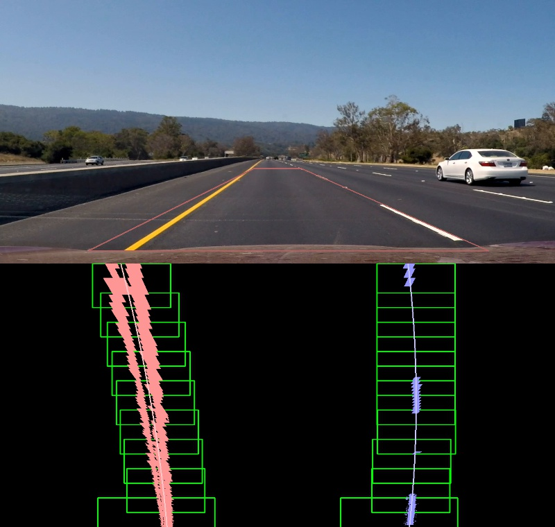
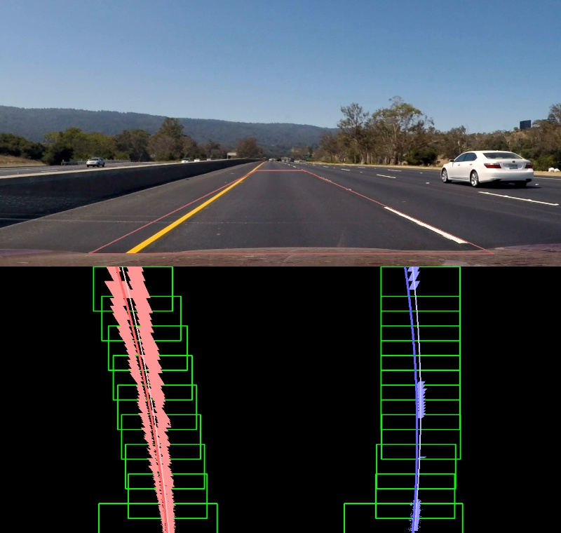
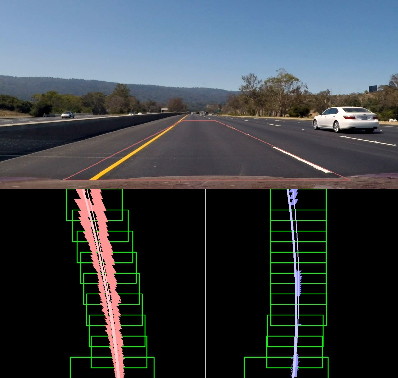
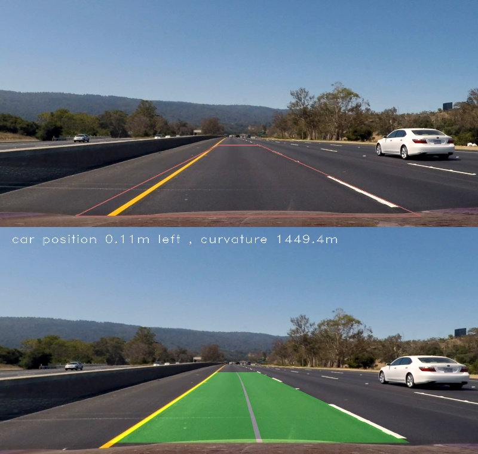

# **Advanced Lane Finding Project**

##1. Camera Calibration

###1.1 Computation of the camera calibration matrix and distortion coefficients 

The code for this step is contained in "project_code01.py".  
It corrects 3D "object points" and 2D "image points".

"object points" is a list of 3D position, like (x, y, z), at which the checker board corners should exist in the world position.  
The checkerboard can be assumed that it is on the z==0 surface, therefore we can simply define "object points" for each checkerboard image as following code.

```
objp = np.zeros((6*9, 3), np.float32)
objp[:, :2] = np.mgrid[0:9, 0:6].T.reshape(-1, 2)
```

"image points" are the 2D corner positions of the checker board images.
The corner positions are detected automaticaly from images in "camera_cal" folder provided by Udacity using opencv function, cv2.findChessboardCorners as following code.

```
# termination criteria
criteria = (cv2.TERM_CRITERIA_EPS + cv2.TERM_CRITERIA_MAX_ITER, 30, 0.001)

gray = cv2.cvtColor(img, cv2.COLOR_BGR2GRAY)
# Find the chessboard corners
ret, corners = cv2.findChessboardCorners(gray, (9, 6), None)
```
 
Here, "criteria" is used to calculate the corner positions with high precision.  
After "cv2.findChessboardCorners" exit normally, 
the corner positions are calculated again via "cv2.cornerSubPix" function with subpixel precision.
Then the image corner positions and the object world points are appended into lists, objpoints and imgpoints as following code.

```
# If found, add object points, image points
if ret:
    # calculate subpixel positions
    cv2.cornerSubPix(gray, corners, (11,11), (-1,-1), criteria)
    
    objpoints.append(objp)
    imgpoints.append(corners)

```

This process is repeated for 20 images in the "camera_cal" folder.  
Then the objpoints and imgpoints are used to compute the camera calibration and distortion coefficients using the cv2.calibrateCamera() function.
Once the coefficients are given, we can do distortion correction to images using the "cv2.undistort()" function and obtaine this result as following code.

```
# Test undistortion on an image
img = cv2.imread('../camera_cal/calibration1.jpg')
img_size = (img.shape[1], img.shape[0])

# Do camera calibration given object points and image points
ret, mtx, dist, rvecs, tvecs = cv2.calibrateCamera(objpoints, imgpoints, img_size, None, None)

dst = cv2.undistort(img, mtx, dist, None, mtx)
```

Following figure is the result.  
This undistortion process mostly works well, but the undistorted image still has some distortion on the left side of the image.


Following figure is a result computed with pixel precision (not subpixel).  
There is not specific difference between pixel and subpixel precision for this project.


##2. Pipeline (single images)

###2.1. Distortion Correction
Following images are a sample input image and its undistorted image.  
It shows bented objects, like lanes and flyover roads, on the input image are corrected via the undistortion process described above.


###2.2. Binary Image Conversion
This code for this step creates binary images for each frames in the input video.  
The binary images are used to the latter finding-lanes process.

Generally, such binary images can have a lot of pseudo information to cause troubles on line-finding algorithms,
so I tried to restrict each target objects to detect.

####2.2.1 Edge on the Road

First, I got binary images via edge based method lectured on the lesson.
It works very well but has some issues as follows.

- weak at yellow lines
- strong shades and shadows cause failure at lane-detecton

TODO 画像を用意する

####2.2.2 Two types of Yellow line
I checked three videos, and found there are roughly two types of Yellow-line.
Because they have a little bit different Hue and Luminance, so I have two set of thresholds for them.

TODO codeを用意する

TODO 画像を用意する


####2.2.3 White line
Egde-base method detects white lines but as hollow shapes.
Because Sliding-windows method for lane detection estimates lines with the number of pixles in each window, solid shapes would be matched with the method.

White color has no specific Hue

- not excessively exposed area


TODO 画像を用意する

####2.2.4 Not boundary line on asphalt

- strong shades and shadows cause failure at lane-detecton

TODO 画像を用意する

####2.2.5 Not excessively exposed area
TODO 画像を用意する

- not boundary line on asphalt


####2.2.6 Combined binary image
TODO 画像を用意する

論理演算

 on the binary images as following.  
Here's an example of my output for this step.




###2.3. Perspective Transformation
"warper()" functon in the code executes my perspective transform, which function takes as inputs an image "img" and an Matrix "M".

"M" is supposed to be calculated in advance via cv2.getPerspectiveTransform() with following parameters.  
These parameters are based on the values at "writeup_template.md" in the project, except avoiding the vehivle's bonnet.

| Source        | Destination   | 
|:-------------:|:-------------:| 
| 585, 460      | 320, 0        | 
| 203, 685      | 320, 720      |
| 1127, 685     | 960, 720      |
| 695, 460      | 960, 0        |

<!--  -->


Before I took the Udacity provided values, I had some trial to use farther road than the sample code, but could not get good result. 
The video resolution don't seem to match at long distance roads and caused troubles at latter processes.  
The failure parameters and the transformed image is as follows ().

| Source        | Destination   | 
|:-------------:|:-------------:| 
| 600, 440      | 320, 0        | 
| 640, 440      | 320, 720      |
| 1105, 675     | 960, 720      |
| 295, 675      | 960, 0        |



In addition to the result of the experiment, I don't have any information about distance in the videos except the sample parameters means actually 30m in the real world.


###2.4. Lane-Line pixels and fitting positions with a polynomial

"sliding_windows_search()" functon in the code executes my perspective transform, which function takes as inputs an binary image "image".

This function is based on the first sample of "siliding windows search" in the lesson, and modified to have inertia when there is not enough number of good_index in a window.
To prevent excessive inertia, sliding windows have overlapping.

The function extracts two index lists for left and right lane-line.
And the detected index points are approximated into a quadratic polynomial via numpy function "np.polyfit()".  
So two sets of the quadratic polynomial coefficients are outputed from the function with a image which shows the execursions of the sliding-windows.

<!--  -->

Following figure shows the two polynomials and the execursions.




###2.5. 




###2.6. The radius of curvature of the lane and the position of the vehicle with respect to center

I did this in lines # through # in my code in `my_other_file.py`


###2.7. An example image plotted back down onto the road the lane area

I implemented this step in lines # through # in my code in `yet_another_file.py` in the function `map_lane()`.  Here is an example of my result on a test image:




---

##3. Pipeline (video)

###3.1. Provide a link to your final video output.  Your pipeline should perform reasonably well on the entire project video (wobbly lines are ok but no catastrophic failures that would cause the car to drive off the road!).

Here's a [link to my video result](./project_video.mp4)

https://github.com/somof/CarND-Advanced-Lane-Lines-work/
https://github.com/somof/CarND-Advanced-Lane-Lines-work/output_images/project_video.mp4
https://github.com/somof/CarND-Advanced-Lane-Lines-work/output_images/project_video.mp4

---

##4. Conclusion


###4.1 Discussion

#### 1. Briefly discuss any problems / issues you faced in your implementation of this project.  Where will your pipeline likely fail?  What could you do to make it more robust?

Here I'll talk about the approach I took, what techniques I used, what worked and why, where the pipeline might fail and how I might improve it if I were going to pursue this project further.  
