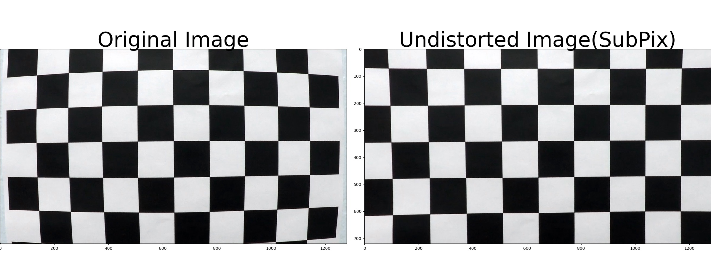
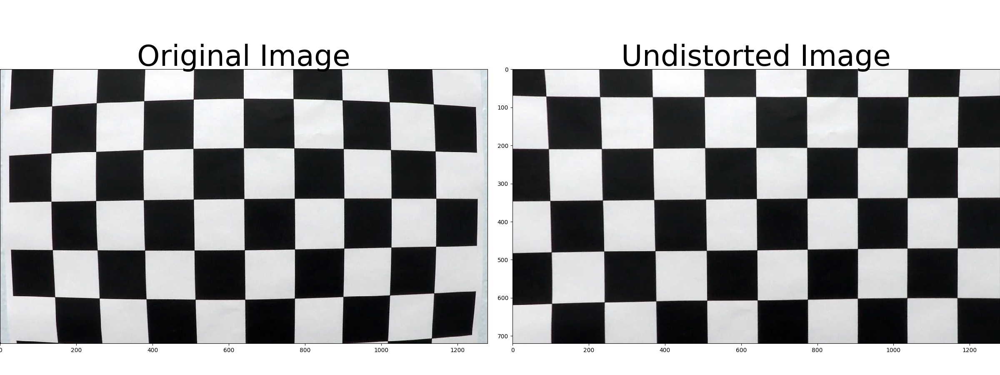

# **Advanced Lane Finding Project**

The goals / steps of this project are the following:

TODO 曲率を一つにする
TODO レポート様に表示を変える


主な提出物は詳細なレポート

* Compute the camera calibration matrix and distortion coefficients given a set of chessboard images.
  チェッカーボードの補正用係数を計算する
  note these are 9x6 chessboard images, unlike the 8x6 images used in the lesson
* Apply a distortion correction to raw images.
  raw image ?? に適用する
* Use color transforms, gradients, etc., to create a thresholded binary image.
  二値化イメージを作る
  just visual verification
* Apply a perspective transform to rectify binary image ("birds-eye view").
  鳥瞰図を作る
* Detect lane pixels and fit to find the lane boundary.
  レーン境界を合わせる
* Determine the curvature of the lane and vehicle position with respect to center.
  レーンの曲率と、車の位置を決める
* Warp the detected lane boundaries back onto the original image.
  検出したレーン境界を、元の画像にあてはめる
* Output visual display of the lane boundaries and numerical estimation of lane curvature and vehicle position.
  それを表示する

追加メモ
動画のキャリブはどうやって？

3.66m 車線幅

30m from lesson


* Suggestions to Make Your Project Stand Out!
  信頼性の高い検出結果を元に、次フレームを検索し、速度とロバスト性を向上させるなど
  更に、 you should implement outlier rejection and use a low-pass filter to smooth the lane detection over frames, 
         meaning add each new detection to a weighted mean of the position of the lines to avoid jitter.
  その場合、 implement these methods on the challenge videos as well, or on your own videos you've recorded yourself.


[//]: # (Image References)

[image2]: ./test_images/test1.jpg "Road Transformed"
[image3]: ./examples/binary_combo_example.jpg "Binary Example"
[image4]: ./examples/warped_straight_lines.jpg "Warp Example"
[image5]: ./examples/color_fit_lines.jpg "Fit Visual"
[image6]: ./examples/example_output.jpg "Output"
[video1]: ./project_video.mp4 "Video"

### Here I will consider the rubric points individually and describe how I addressed each point in my implementation.  

---


##1. Camera Calibration

###1.1 Computation of the camera calibration matrix and distortion coefficients 

The code for this step is contained in "project_code01.py".  
It corrects 3D "object points" and 2D "image points".

"object points" is a list of 3D position, like (x, y, z), at which the checker board corners should exist in the world position.  
The checkerboard can be assumed that it is on the z==0 surface, therefore we can simply define "object points" for each checkerboard image as following code.

```
objp = np.zeros((6*9, 3), np.float32)
objp[:, :2] = np.mgrid[0:9, 0:6].T.reshape(-1, 2)
```

"image points" are the 2D corner positions of the checker board images.
The corner positions are detected automaticaly from images in "camera_cal" folder provided by Udacity using opencv function, cv2.findChessboardCorners as following code.

```
# termination criteria
criteria = (cv2.TERM_CRITERIA_EPS + cv2.TERM_CRITERIA_MAX_ITER, 30, 0.001)

gray = cv2.cvtColor(img, cv2.COLOR_BGR2GRAY)
# Find the chessboard corners
ret, corners = cv2.findChessboardCorners(gray, (9, 6), None)
```
 
Here, "criteria" is used to calculate the corner positions with high precision.  
After "cv2.findChessboardCorners" exit normally, 
the corner positions are calculated again via "cv2.cornerSubPix" function with subpixel precision.
Then the image corner positions and the object world points are appended into lists, objpoints and imgpoints as following code.

```
# If found, add object points, image points
if ret:
    # calculate subpixel positions
    cv2.cornerSubPix(gray, corners, (11,11), (-1,-1), criteria)
    
    objpoints.append(objp)
    imgpoints.append(corners)

```

This process is repeated for 20 images in the "camera_cal" folder.  
Then the objpoints and imgpoints are used to compute the camera calibration and distortion coefficients using the cv2.calibrateCamera() function.
Once the coefficients are given, we can do distortion correction to images using the "cv2.undistort()" function and obtaine this result as following code.

```
# Test undistortion on an image
img = cv2.imread('../camera_cal/calibration1.jpg')
img_size = (img.shape[1], img.shape[0])

# Do camera calibration given object points and image points
ret, mtx, dist, rvecs, tvecs = cv2.calibrateCamera(objpoints, imgpoints, img_size, None, None)

dst = cv2.undistort(img, mtx, dist, None, mtx)
```

Following figure is the result.  
This undistortion process mostly works well, but the undistorted image still has some distortion on the left side of the image.




Following figure is a result computed with pixel precision (not subpixel).  
There is not specific difference between pixel and subpixel precision for this project.




TODO ここから書き直す

##2. Pipeline (single images)

###2.1. An example of a distortion-corrected image

Following images are a sample input image and a its undistorted image.  
It shows bented objects on the input image are corrected via the undistortion process described above.

![alt text][image2]


###2.2. An example of a binary image

This code for this step creates binary images for each frames in the input video.  
The binary images are used to the latter finding-lanes process.

Generally such binary images can have a lot of pseudo information to make troubles on line-finding algorithms.
So I tried to restrict target objects to detect on the binary images as following.

- 2 types of Yellow line
- White line

Actually

- not boundary line on asphalt
- not excessively exposed area

####2.2.1 Two types of Yellow line
TODO 画像を用意する
####2.2.2 White line
TODO 画像を用意する
####2.2.3 Not boundary line on asphalt
TODO 画像を用意する
####2.2.4 Not excessively exposed area
TODO 画像を用意する
####2.2.5 Combined binary image
TODO 画像を用意する


a perspective transform 

Color transforms, gradients or other methods to create a thresholded binary image.  

Provide 


I used a combination of color and gradient thresholds to generate a binary image (thresholding steps at lines # through # in `another_file.py`).  Here's an example of my output for this step.  (note: this is not actually from one of the test images)


```

```


![alt text][image3]


###2.3. Describe how (and identify where in your code) you performed a perspective transform and provide an example of a transformed image.

欲張って
遠くまで見ると
激しく暴れる

解像度が必要


The code for my perspective transform includes a function called `warper()`, which appears in lines 1 through 8 in the file `example.py` (output_images/examples/example.py) (or, for example, in the 3rd code cell of the IPython notebook).  The `warper()` function takes as inputs an image (`img`), as well as source (`src`) and destination (`dst`) points.  I chose the hardcode the source and destination points in the following manner:

```python
src = np.float32(
    [[(img_size[0] / 2) - 55, img_size[1] / 2 + 100],
    [((img_size[0] / 6) - 10), img_size[1]],
    [(img_size[0] * 5 / 6) + 60, img_size[1]],
    [(img_size[0] / 2 + 55), img_size[1] / 2 + 100]])
dst = np.float32(
    [[(img_size[0] / 4), 0],
    [(img_size[0] / 4), img_size[1]],
    [(img_size[0] * 3 / 4), img_size[1]],
    [(img_size[0] * 3 / 4), 0]])
```

This resulted in the following source and destination points:

| Source        | Destination   | 
|:-------------:|:-------------:| 
| 585, 460      | 320, 0        | 
| 203, 720      | 320, 720      |
| 1127, 720     | 960, 720      |
| 695, 460      | 960, 0        |

I verified that my perspective transform was working as expected by drawing the `src` and `dst` points onto a test image and its warped counterpart to verify that the lines appear parallel in the warped image.

![alt text][image4]

###2.4. Describe how (and identify where in your code) you identified lane-line pixels and fit their positions with a polynomial?

Then I did some other stuff and fit my lane lines with a 2nd order polynomial kinda like this:

![alt text][image5]

###2.5. Describe how (and identify where in your code) you calculated the radius of curvature of the lane and the position of the vehicle with respect to center.

I did this in lines # through # in my code in `my_other_file.py`

###2.6. Provide an example image of your result plotted back down onto the road such that the lane area is identified clearly.

I implemented this step in lines # through # in my code in `yet_another_file.py` in the function `map_lane()`.  Here is an example of my result on a test image:

![alt text][image6]

---

##3. Pipeline (video)

###3.1. Provide a link to your final video output.  Your pipeline should perform reasonably well on the entire project video (wobbly lines are ok but no catastrophic failures that would cause the car to drive off the road!).

Here's a [link to my video result](./project_video.mp4)

---

##4. Conclusion


###4.1 Discussion

#### 1. Briefly discuss any problems / issues you faced in your implementation of this project.  Where will your pipeline likely fail?  What could you do to make it more robust?

Here I'll talk about the approach I took, what techniques I used, what worked and why, where the pipeline might fail and how I might improve it if I were going to pursue this project further.  
